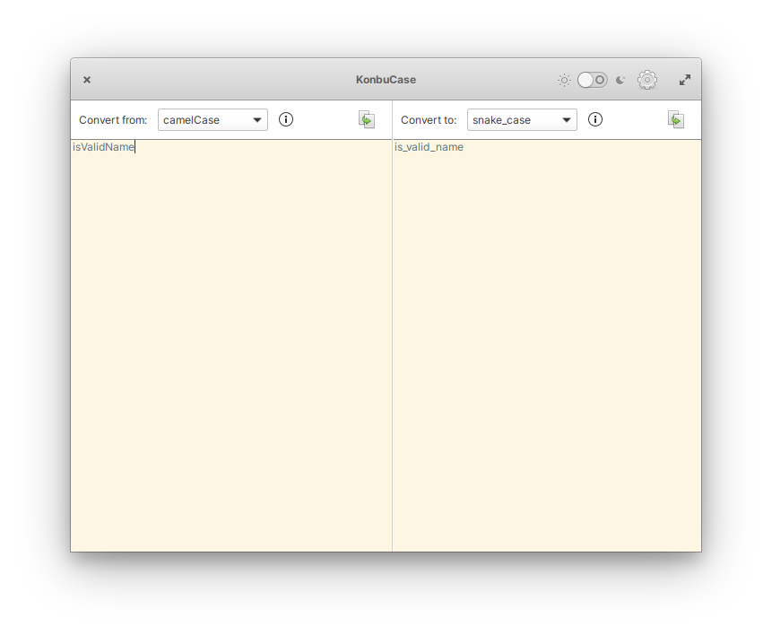

# KonbuCase

KonbuCase is a simple case converting app. Features include:

* Click "Copy to Clipboard" button to copy the all texts in the text view without selecting them
* Convert your text between camelCase, PascalCase, Sentence case, snake_case, kebab-case, and space-separated

## Installation
### For Users
On elementary OS? Click the button to get KonbuCase on AppCenter:

You can also download the app from Flathub, in case you're using another distribution. This version excludes the feature to respect OS-wide style preference which depends on Pantheon desktop environment.

Community packages maintained by volunteers are also available on some distributions:

### For Developers
You'll need the following dependencies:

* [libchcase](https://github.com/ryonakano/chcase) (automatically downloaded on build)
* libgranite-7-dev
* libgtk4-dev
* libgtksourceview-5-dev
* meson (>= 0.49.0)
* valac

Run `meson build` to configure the build environment. Change to the build directory and run `ninja` to build

    meson build --prefix=/usr
    cd build
    ninja

To install, use `ninja install`, then execute with `com.github.ryonakano.konbucase`

    ninja install
    com.github.ryonakano.konbucase

## Contributing
There are many ways you can contribute, even if you don't know how to code.

### Reporting Bugs or Suggesting Improvements
Simply [create a new issue](https://github.com/ryonakano/konbucase/issues/new) describing your problem and how to reproduce or your suggestion. If you are not used to do, [this section](https://docs.elementary.io/contributor-guide/feedback/reporting-issues) is for you.

### Writing Some Code
We follow [the coding style of elementary OS](https://docs.elementary.io/develop/writing-apps/code-style) and [its Human Interface Guidelines](https://docs.elementary.io/hig/). Try to respect them.

### Translating This App
I accept translations through Pull Requests. If you're not sure how to do, [the guideline I made](po/README.md) might be helpful.

## The Story of the App Name

I always feel the pronunciations "Konbu" and "Conv" (Convert) sound similar (you may not feel though…). This app is a **case conv**erter, so I named this app "KonbuCase".
