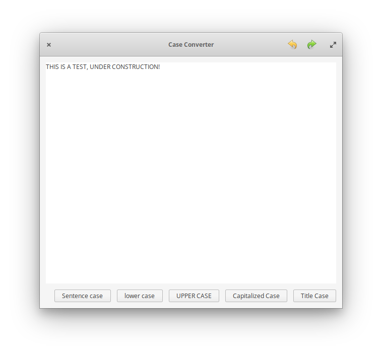

# Case Converter

## Building and Installation
You'll need the following dependencies:

* libgtk-3.0-dev
* libgranite-dev (>= 5.2.3)
* valac

Run `valac` to build, and then execute with `./Application`

    valac --pkg gtk+-3.0 --pkg granite Application.vala
    ./Application
