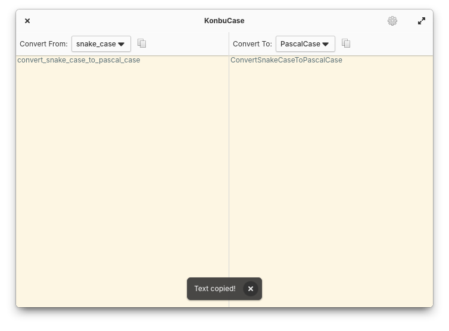

# KonbuCase


KonbuCase is a simple case converting app. Features include:

* Click "Copy to Clipboard" button to copy the all texts in the text view without selecting them
* Convert your text between camelCase, PascalCase, Sentence case, snake_case, kebab-case, and space-separated

## Installation
### For Users
On elementary OS? Click the button to get KonbuCase on AppCenter:

[](https://appcenter.elementary.io/com.github.ryonakano.konbucase)

You can also download the app from Flathub, in case you're using another distribution.

[](https://flathub.org/apps/details/com.github.ryonakano.konbucase)

Community packages maintained by volunteers are also available on some distributions:

[](https://repology.org/project/konbucase/versions)

### For Developers
You'll need the following dependencies:

* [libchcase](https://github.com/ryonakano/chcase)
    * automatically downloaded on build
* libgranite-7-dev
* libgtk4-dev
* libgtksourceview-5-dev
* meson (>= 0.57.0)
* valac

Run `meson setup` to configure the build environment and run `ninja` to build

```bash
meson setup builddir --prefix=/usr
ninja -C builddir
```

To install, use `ninja install`, then execute with `com.github.ryonakano.konbucase`

```bash
ninja install -C builddir
com.github.ryonakano.konbucase
```

## Contributing

Please refer to [the contribution guideline](CONTRIBUTING.md) if you would like to:

- submit bug reports / feature requests
- propose coding changes
- translate the project

## Get Support

Need help in use of the app? Refer to [the discussions page](https://github.com/ryonakano/konbucase/discussions) to search for existing discussions or [start a new discussion](https://github.com/ryonakano/konbucase/discussions/new/choose) if none is relevant.

## The Story of the App Name


I always feel the pronunciations "Konbu" and "Conv" (Convert) sound similar (you may not feel though…). This app is a **case conv**erter, so I named this app "KonbuCase".
